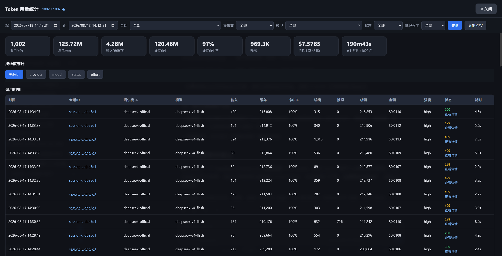
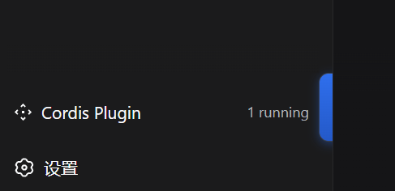

# dsh-token-usage — DSH Token 用量记录与统计插件

记录 DeepSeek Harness 中所有 LLM API 调用（模型请求），提供单窗口全屏统计面板。
支持秒级时间范围查询、多维度筛选、会话 ID 筛选、排序、状态码与调用详情、分组统计表与 CSV 导出。

## 界面截图



*Token 用量统计面板：汇总卡片、多维度筛选、状态码与调用明细*



*侧边栏底部"Token 用量"入口按钮*

## 功能特性

- **醒目入口**：侧边栏底部蓝色渐变大按钮 "Token 用量"，一键打开全屏面板。
- **秒级时间查询**：起止 `datetime-local`（精确到秒）过滤调用记录。
- **默认不限制时间**：打开面板默认时间不选、显示全部记录（不再默认"当天"）；筛选条件自动暂存（localStorage），下次打开恢复上次条件；点【重置】清空全部条件回到显示全部。
- **提供商/模型下拉去重合并**：选项 = 现有配置（`settings.yaml` 的 `llm-pi-ai.providers`）∪ 历史记录，无记录时仍可选现有提供商，已删除的提供商/模型因有记录仍可选中。
- **多维度筛选**：会话 ID / 模型提供商 / 模型 / 状态 / 推理强度 下拉筛选。
- **排序**：明细表**全部 15 列**点击表头可排序（时间/会话ID/提供商/模型/输入/缓存/命中%/输出/推理/总额/金额/金额(¥)/强度/状态/耗时），升降序切换。默认按**时间倒序**（最新在前）。
- **金额双币显示**：明细表与统计表金额均为 USD + 人民币两列；定价表以官方人民币刊例为基准（支持 DeepSeek-V4 峰谷两档），人民币按汇率换算（默认 7.2，可用 `settings.yaml` 的 `token-usage.usdCnyRate` 覆盖），CSV 导出含 `costCny` 列。
- **会话 ID**：明细表显示会话 ID（缩略），点击任意会话 ID 即按该会话筛选。
- **状态码 + 详情**：状态列显示 HTTP 状态码（200 成功 / 400 / 401 / 429 / 500 等，来自 `turn/end` 错误），状态下方【查看详情】弹窗展示完整信息（含会话 ID、错误信息、错误码、各 Token 桶、金额、耗时、Turn/Step 等）。
- **统计表**：按 provider / model / status / effort 分组汇总（调用数、各 Token、命中率、金额、耗时）。
- **CSV 导出**：按当前筛选导出全字段明细。

## 数据来源

插件不侵入模型调用链路，只读取 DSH 会话日志（`session/event` 事件 + 历史扫描），
从以下会话事件中提取每次模型调用的完整信息：

| 字段 | 来源 | 说明 |
|---|---|---|
| 时间 | 事件 `time` | Unix epoch ms，秒级精确 |
| 模型提供商 | `request/header.config.provider` | 路由名（如 ocx） |
| 模型 | `request/header.config.model` | 模型 id |
| apikey | 配置 `apiKeyEnv` | 仅存掩码（安全，见下） |
| 输入 Token | `assistant/message.usage.inputTokens` | 未命中缓存输入 |
| 输出 Token | `usage.outputTokens` | 含推理 token |
| 缓存命中量 | `usage.cacheReadTokens` | |
| 缓存写入量 | `usage.cacheWriteTokens` | |
| 推理 Token | `usage.reasoningTokens` | |
| 缓存命中率 | 计算 | `cacheRead/(input+cacheRead)` |
| 消耗金额 | 内置定价表估算(人民币/1M) | 含 DeepSeek-V4 峰谷两档、可配置覆盖 |
| 推理强度 | `config.reasoningEffort` | |
| 状态 | `turn/end.reason.kind` | completed/error/aborted/... |
| 状态码 | `turn/end.reason.error.status` | 真实 HTTP 码（如 400/401/429），无则映射 200/403/499/500 |
| 错误信息/码 | `turn/end.reason.error.message/code` | 详情弹窗展示 |
| 会话 ID | 事件所属 session id | 可点击筛选、详情展示 |
| 耗时 | `step/start → assistant/message` | llmMs |

## 安装

### 方式一：npm 包（推荐，已发布）

```bash
dsh plugin --profile <profile名> add @wycto/dsh-token-usage
```

安装后重启 DSH（`dsh --profile <profile名>`），侧边栏底部出现蓝色"Token 用量"按钮。

### 方式二：本地开发体验

1. 将 `lib/index.js`（Host）与 `client/index.js`（Client web）放入 `src/`。
2. `cordis.patch.yml` 插入插件行（`name`/`id` 用带 scope 的包名 `@wycto/dsh-token-usage`）。
3. `pnpm dsh web --patch ./dsh-token-usage/cordis.patch.yml`

## 发布与更新

详见 [`PUBLISH.md`](./PUBLISH.md)：打包为带 `dsh.bundle` manifest 的 npm 组合包。

| 操作 | 命令 |
|---|---|
| 登录 npm | `npm adduser` |
| 首次发布 | `npm publish` |
| 升小版本（0.1.0 → 0.1.1，修复） | `npm version patch && npm publish` |
| 升中版本（0.1.1 → 0.2.0，新功能） | `npm version minor && npm publish` |
| 升大版本（0.2.0 → 1.0.0） | `npm version major && npm publish` |

> `npm version` 会自动修改 `package.json` 版本号并打 git tag（如 `v0.1.0`），
> 推送 tag 用 `git push --tags`。包名 scope `@wycto/` 与 npm 账号一致，可直接发布。

- npm 包主页：<https://www.npmjs.com/package/@wycto/dsh-token-usage>
- 源码仓库：<https://github.com/wycto/dsh-token-usage>

## 安全

- **apikey 永不落明文**：仅展示掩码（`sk-***abcd`）。DSH 凭据本来也只在
  `.credentials.yaml` / 环境变量，插件不复制密钥。
- 记录为本地内存索引，进程重启后自动从会话日志重建（数据源即 DSH 自身持久化日志）。

## 金额与定价

金额为**估算**：内置常见模型单价表（**人民币元 / 百万 tokens** 为基准），未知模型用 fallback 单价。

**峰谷定价**：DeepSeek-V4 官方已实行峰谷计费（[2026-08-17 生效](https://news.qq.com/rain/a/20260817A08RSA00)），
高峰时段为每日 **9:00–14:00**（按插件运行机器本地时间判断），价格为空闲时段的 2 倍。内置 v4-flash / v4-pro 两档：

| 模型 | 时段 | 输入(缓存未命中) | 输出 | 输入(缓存命中) |
|---|---|---|---|---|
| deepseek-v4-flash | 空闲 | 1.5 | 4.5 | 0.05 |
| deepseek-v4-flash | 高峰 | 3.0 | 9.0 | 0.10 |
| deepseek-v4-pro | 空闲 | 4.5 | 13.5 | 0.15 |
| deepseek-v4-pro | 高峰 | 9.0 | 27.0 | 0.30 |

**官方价格可能变动**：改价无需升级插件，插件**每天自动从官网获取最新定价**（解析 HTML 表格提取价格），
获取失败时回退内置默认值；也可在 `settings.yaml` 手动覆盖任意条目，重启后生效：

```yaml
token-usage:
  usdCnyRate: 7.2              # USD↔CNY 汇率（默认 7.2）
  pricingUrl: 'https://api-docs.deepseek.com/zh-cn/quick_start/pricing'  # 官网定价页（可自定义）
  pricingFetchIntervalHours: 24 # 自动获取间隔（小时，默认 24）
  pricing:                       # 可选：手动覆盖/新增条目（优先级高于自动获取）
    deepseek-v4-flash:
      input: 1.5           # 元/百万 tokens（空闲时段）
      output: 4.5
      cacheRead: 0.05
      cacheWrite: 0        # DeepSeek 官方不收取缓存写入
      peak:                # 可选：高峰时段（本地时间 start<=h<end）
        start: 9
        end: 14
        input: 3.0
        output: 9.0
        cacheRead: 0.10
        cacheWrite: 0
    '*':                   # 可选：覆盖未知模型的 fallback 单价
      input: 2.16
      output: 6.48
      cacheRead: 0.43
      cacheWrite: 4.32
```

## 已知边界

- 金额为**估算**：内置常见模型单价表；未知模型用 fallback 单价（见上，可配置覆盖）。
- 失败调用（无 `assistant/message`）不产生 token 记录；状态列反映 turn 结局。
- 本机为 OCX 网关时 `usage` 字段可能缺失，此时 token 数显示 0。